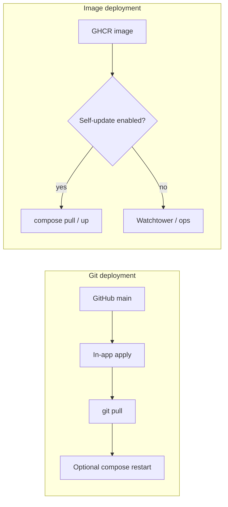

# Webable

**Webable** is a local-first personal finance web app — it runs on your own machine via Docker, and your data never leaves it. Track income and expenses, project cash flow, upload bank statements, and optionally chat with a local AI.

> **GitHub Pages** (from `docs/`) only serves a static install page. It does **not** run the Python backend and never sees your financial data.

---

## Features

- Register and log in with session-based auth (data stays on your machine)
- Multiple isolated workspaces, each with its own SQLite database
- Recurring income/expenses, one-off transactions, monthly and long-range projections
- Bank statement PDF uploads, reports, savings and investment calculators, market watch helpers
- Optional AI chat via Ollama (`minimax-m2.5:cloud` by default; not required for core budgeting)

---

## Quick start

### 1. Install prerequisites

Pick your OS:

**Linux**

```bash
# Arch
sudo pacman -Syu git docker docker-compose
sudo systemctl enable --now docker

# Debian / Ubuntu
sudo apt update && sudo apt install -y git docker.io docker-compose-plugin
sudo systemctl enable --now docker

# Fedora / RHEL / Rocky
sudo dnf install -y git docker docker-compose-plugin
sudo systemctl enable --now docker
```

> **Optional:** add yourself to the `docker` group so you don't need `sudo` every time:
> ```bash
> sudo usermod -aG docker $USER && newgrp docker
> ```

**Windows (PowerShell)**

```powershell
winget install -e --id Git.Git
winget install -e --id Docker.DockerDesktop
```

Restart PowerShell after Docker Desktop finishes installing, then continue to step 2.

**macOS**

```bash
# Install Homebrew if you don't have it:
/bin/bash -c "$(curl -fsSL https://raw.githubusercontent.com/Homebrew/install/HEAD/install.sh)"

brew install git
brew install --cask docker
open /Applications/Docker.app   # must be running before any docker command
```

---

### 2. Clone and run

```bash
git clone https://github.com/zeromeia0/webable.git
cd webable
docker compose up -d --build
```

Then open **http://localhost:8080** in your browser.

That's it. Data is stored in `./data` on your machine and persists across restarts and rebuilds.

### Optional AI (Ollama Cloud)

`docker-compose.yml` includes an **Ollama** sidecar (`webable-ollama`). Webable works without it — the dashboard and budgeting features do not call AI on page load.

After starting containers:

```bash
docker compose up -d
```

AI requires **Ollama Cloud sign-in** (containers can be healthy before this step):

```bash
sudo docker exec -it webable-ollama ollama signin
```

Test the model:

```bash
sudo docker exec -it webable-ollama ollama run minimax-m2.5:cloud
```

The default model is **`minimax-m2.5:cloud`** (cloud-backed). Webable does **not** run `ollama pull` at startup.

Environment (set in Compose for the `webable` service):

| Variable | Default (Docker) |
|----------|------------------|
| `OLLAMA_BASE_URL` | `http://ollama:11434` |
| `OLLAMA_MODEL` | `minimax-m2.5:cloud` |

For local uvicorn without Docker, point at your host Ollama: `OLLAMA_BASE_URL=http://127.0.0.1:11434`.

If Webable shows *AI is not available right now. Make sure Ollama is running and **signed in**.*, click **signed in** in the chat panel. Webable asks the Ollama API for a fresh sign-in link when possible (`GET /api/ai/ollama/signin-link`), or shows the manual commands above.

---

## Stopping, restarting, and updating

| Action | Command |
|--------|---------|
| Stop | `docker compose down` |
| Restart | `docker compose restart` |
| Update to latest | `git pull && docker compose up -d --build` |
| View logs | `docker compose logs -f` |
| Check status | `docker compose ps` |

### Makefile shortcuts (optional)

If you have GNU Make installed (`winget install -e --id GnuWin32.Make` on Windows):

```bash
make up       # docker compose up -d --build
make down     # docker compose down
make logs     # docker compose logs -f
make restart  # docker compose restart
make update   # git pull && docker compose up -d --build
make up-image        # pull ghcr.io/.../webable (tag from VERSION) — see “Prebuilt images” below
make up-watchtower   # GHCR image + Watchtower sidecar for automatic image pulls
```

### Prebuilt images (GHCR) and Watchtower

Webable distinguishes **two deployment models** (see `GET /api/build-info` and the Dashboard “About this app” card):

| Model | Typical layout | Who applies updates |
|--------|----------------|---------------------|
| **Git** | `.git` exists at the app root | In-app **Apply update** when `WEBABLE_AUTO_UPDATE=1` (git fetch / pull). Optional `WEBABLE_GIT_UPDATE_USE_COMPOSE_RESTART=1` + `WEBABLE_DOCKER_COMPOSE_PATH` to restart the container after pull. |
| **Image** | No `.git`; immutable image (e.g. GHCR) | **Externally** (Watchtower, K8s, manual `docker compose pull`), **or** in-app **Update now** when `WEBABLE_ALLOW_IMAGE_SELF_UPDATE=1` and `WEBABLE_DOCKER_COMPOSE_PATH` point to a **validated** compose file on a host with the Docker CLI and socket (same machine as Compose). |

Set `WEBABLE_EXPECT_EXTERNAL_UPDATER=1` when Watchtower (or similar) is responsible so the UI explains that one-click updates may not apply immediately.



1. **Run a pinned version** (recommended): the repo root `VERSION` file tracks the default tag. `make up-image` passes it as `WEBABLE_VERSION`, or set it explicitly:

   ```bash
   WEBABLE_VERSION=1.0.0 docker compose -f docker-compose.image.yml up -d
   ```

2. **Automatic updates:** merge `docker-compose.image.yml` with `docker-compose.watchtower.yml`. Watchtower only recreates containers that have the label `com.centurylinklabs.watchtower.enable=true` (already set on the `webable` service). Your data stays in `./data` on the host.

   ```bash
   WEBABLE_VERSION=1.0.0 docker compose -f docker-compose.image.yml -f docker-compose.watchtower.yml up -d
   ```

3. **Rollback:** set `WEBABLE_VERSION` to an older tag (or pin by digest in `docker-compose.image.yml`) and `docker compose up -d`.

4. **Build metadata & capabilities:** `GET /api/build-info` returns `version`, `commit`, `build_id`, `build_time`, `channel`, `deployment_mode`, update-capability flags, and `update_in_progress`. `GET /api/update/status` adds GitHub comparison fields plus `orchestration` (phase, message, errors). Signed-in users can call `POST /api/update/start` for a one-click job when the deployment supports it.

5. **Compose files in this repo:** `docker-compose.yml` — local build / dev. `docker-compose.image.yml` — pull-only GHCR. `docker-compose.watchtower.yml` — optional sidecar.

This path does **not** use in-container `git` for image installs. The **git** flow (`WEBABLE_AUTO_UPDATE`, `update.md`, `/api/update/*`) remains for installs that are a git working tree on disk.

---

## Verify it's working

```bash
curl -sS http://127.0.0.1:8080/health
# → {"status":"ok"}
```

---

## Data and backups

- All data lives in **`./data`** on your host machine (mounted into the container at `/app/data`).
- It survives `docker compose down`, restarts, and image rebuilds — the Docker image itself contains no personal data.
- **To back up:** copy the entire `data/` folder somewhere safe, or run `bash scripts/webable-backup.sh`.
- **Warning:** deleting `data/` permanently removes all workspaces, uploads, and databases.

### Where your data is stored

| What | Location |
|------|----------|
| App database (users, workspaces, jobs) | `data/webable_app.db` |
| Workspace finance data | `data/user_<id>/*_financas.db` |
| Workspace logic data (IEFP) | `data/user_<id>/*_logic.db` |
| Bank statement PDFs | `data/statements/<workspace_id>/` |
| FX cache | `data/fx_cache.json` |

These paths are in `.gitignore` — they are **never** committed to git.

### Safe migrations (additive only)

Webable does **not** wipe your data on update. Schema changes use `ALTER TABLE` and new columns only.

```bash
# After backup (recommended):
python3 -m app.cli migrate
# or:
bash scripts/webable-migrate.sh
```

---

## Updating the App Without Losing Data

Follow these steps when you pull a new version. **Do not delete `data/`** unless you intend to erase everything.

### What NOT to delete

- `data/` (all SQLite databases and uploads)
- `data/webable_app.db`
- `data/user_*` folders
- `data/statements/`

Never run `rm -rf data`, `docker volume prune` on your data volume, or replace `data/` with an empty folder from git.

### Linux

1. **Back up** (copy the whole folder):
   ```bash
   cd /path/to/webable
   bash scripts/webable-backup.sh
   ```
   Backups are saved next to the project as `webable-data-backup-YYYYMMDD-HHMMSS/`.

2. **Get new code:**
   ```bash
   git pull
   ```

3. **Install dependencies** (local dev only):
   ```bash
   source .venv/bin/activate   # if you use a venv
   pip install -r requirements.txt
   ```

4. **Run migrations** (safe, additive):
   ```bash
   bash scripts/webable-migrate.sh
   ```

5. **Restart the app:**
   ```bash
   docker compose up -d --build
   ```
   Or use the all-in-one script: `bash scripts/webable-safe-update.sh`

6. **Verify:** open http://localhost:8080 and confirm your workspaces and transactions are still there.

**Restore from backup:** stop the app, remove or rename the broken `data/` folder, then:
```bash
cp -a webable-data-backup-YYYYMMDD-HHMMSS data
docker compose up -d
```

### macOS

1. **Back up:**
   ```bash
   cd ~/path/to/webable
   bash scripts/webable-backup.sh
   ```

2. **Get new code:**
   ```bash
   git pull
   ```

3. **Install dependencies** (local dev):
   ```bash
   source .venv/bin/activate
   pip install -r requirements.txt
   ```

4. **Run migrations:**
   ```bash
   bash scripts/webable-migrate.sh
   ```

5. **Restart** (Docker Desktop must be running):
   ```bash
   docker compose up -d --build
   ```
   Or: `bash scripts/webable-safe-update.sh`

6. **Verify** in the browser that your data is intact.

**Restore from backup:**
```bash
docker compose down
mv data data.broken
cp -R webable-data-backup-YYYYMMDD-HHMMSS data
docker compose up -d
```

### Windows (PowerShell)

1. **Back up** (manual copy is fine if bash scripts are unavailable):
   ```powershell
   cd C:\path\to\webable
   $stamp = Get-Date -Format "yyyyMMdd-HHmmss"
   Copy-Item -Recurse -Force .\data "..\webable-data-backup-$stamp"
   ```

2. **Get new code:**
   ```powershell
   git pull
   ```

3. **Install dependencies** (local dev):
   ```powershell
   .\.venv\Scripts\activate
   pip install -r requirements.txt
   ```

4. **Run migrations:**
   ```powershell
   $env:WEBABLE_DATA_DIR = ".\data"
   python -m app.cli migrate
   ```

5. **Restart** (Docker Desktop running):
   ```powershell
   docker compose up -d --build
   ```

6. **Verify** at http://localhost:8080

**Restore from backup:**
```powershell
docker compose down
Rename-Item data data.broken
Copy-Item -Recurse "..\webable-data-backup-YYYYMMDD-HHMMSS" data
docker compose up -d
```

### Destructive commands (avoid)

These **will** delete or replace user data:

- `rm -rf data` or deleting `data\` in File Explorer
- Replacing `data/` with an empty directory from the repo
- `git clean -fdx` if it removes ignored `data/`
- Deleting a workspace in the app UI (intentional, but permanent)

Deleting a single workspace via the app only removes **that** workspace’s files, not other users’ data.

---

## Changing the port

If port 8080 is already in use, edit `docker-compose.yml`:

```yaml
ports:
  - "8081:8000"   # change 8080 to any free port on the left side
```

The right side (`8000`) is the port uvicorn listens on inside the container — leave it as-is. Then rebuild:

```bash
docker compose up -d --build
```

---

## Running without Docker (developers)

**macOS / Linux:**

```bash
python3 -m venv .venv
source .venv/bin/activate
pip install -r requirements.txt
uvicorn webapp:app --host 127.0.0.1 --port 8000 --reload
```

**Windows (PowerShell):**

```powershell
python -m venv .venv
.venv\Scripts\activate
pip install -r requirements.txt
uvicorn webapp:app --host 127.0.0.1 --port 8000 --reload
```

Open http://127.0.0.1:8000.

> `WEBABLE_DATA_DIR` controls where data is stored (defaults to `./data`).

---

## Auto-update (GitHub `main`)

Webable can **detect** when the `main` branch on GitHub is ahead of your running build, and show a **non-dismissible** in-app dialog with release notes from the root file **`update.md`**.

| Behavior | Details |
|----------|---------|
| **When** | Once shortly after the server process starts (background), then cached for several minutes (`WEBABLE_UPDATE_CACHE_TTL`, default 300s). |
| **Offline** | If there is no internet, the check is skipped silently. |
| **Compare** | Local revision (git `HEAD`, `.webable-git-rev`, or `WEBABLE_LOCAL_GIT_COMMIT`) vs latest commit SHA from the GitHub API. |
| **Release notes** | Fetched from `https://raw.githubusercontent.com/zeromeia0/webable/main/update.md` (or the same commit SHA when possible). |
| **Data safety** | The updater **never** deletes `WEBABLE_DATA_DIR` (`./data`). It only runs `git fetch` + `git pull --ff-only` when explicitly enabled. |

### Docker (default image)

The standard image **does not** include a `.git` directory. Detection still works if you pass the build-time commit:

```bash
WEBABLE_GIT_COMMIT="$(git rev-parse HEAD)" docker compose build --no-cache
docker compose up -d
```

To **apply** updates inside a container you would need the full repository bind-mounted (including `.git`), `git` installed in the image, and `WEBABLE_AUTO_UPDATE=1` — this is advanced; most users should **`git pull` on the host** and **`docker compose build`** instead.

### Self‑hosted git clone (uvicorn / systemd)

1. Set `WEBABLE_AUTO_UPDATE=1` in the environment (see `.env.example`).
2. Ensure `git` is on `PATH` and the deployment directory is a clone of `https://github.com/zeromeia0/webable.git`.
3. When a user is signed in and taps **Got it**, the server runs **`git pull --ff-only origin main`** (no `git clean`, no reset of `data/`).
4. Restart or reload the process if your supervisor does not auto-reload.

Optional: `WEBABLE_GITHUB_TOKEN` (or `GITHUB_TOKEN`) for a higher GitHub API rate limit.

### Release checklist (maintainer)

1. Edit **`update.md`** on `main` with user-facing bullet points.
2. Merge to `main` and push.
3. Tag or deploy builds with `WEBABLE_GIT_COMMIT` set to the released SHA.

---

## Technology stack

- **Python 3.12+** — Docker image pinned to `3.12-slim`
- **FastAPI**, Uvicorn, SQLAlchemy, Jinja2
- **ReportLab / Matplotlib / pypdf** — PDF features
- **SQLite** — one database per workspace, stored in `./data`

---

## Security

Webable is designed for **local or trusted-network use only**.

- Do not expose it to the public internet without a reverse proxy, HTTPS, and strong authentication.
- Do not commit `data/`, `.env`, or any secrets. Keep them in `.gitignore`.
- Never push real bank exports or financial data to a repository.

---

## Enabling the GitHub Pages install page

1. Push this repo to GitHub.
2. Go to **Settings → Pages**.
3. Set source to **Deploy from a branch**, branch `main`, folder `/docs`.
4. Save — after a short build, the page will be live at `https://<user>.github.io/webable/`.

---

## Troubleshooting

| Problem | What to try |
|---------|-------------|
| **Port 8080 already in use** | Change the left side of the port mapping in `docker-compose.yml` (e.g. `"8081:8000"`), then run `docker compose up -d --build`. |
| **Docker daemon not running** | Windows/macOS: open Docker Desktop and wait for the whale icon. Linux: `sudo systemctl start docker`. |
| **Permission denied on Linux** | Add yourself to the docker group: `sudo usermod -aG docker $USER`, then log out and back in. Or prefix commands with `sudo`. |
| **`docker compose` not found** | Windows/macOS: open Docker Desktop — Compose v2 is bundled. Linux: install `docker-compose-plugin`. |
| **File sharing / bind-mount errors** | Docker Desktop → Settings → Resources → File Sharing — make sure the project folder's drive is shared. |
| **WSL 2 not installed (Windows)** | Run `wsl --install` in an admin PowerShell, reboot, then reopen Docker Desktop. |
| **Browser can't reach localhost** | Run `docker compose ps` to confirm the container is running. Check logs with `docker compose logs -f`. Try `curl -sS http://127.0.0.1:8080/health`. |
| **Container exits immediately** | Run `docker compose logs webable` and look for a traceback (often a missing bind-mount or permission error). |

---

## Project layout

```
.
├── app/
│   ├── auth.py
│   ├── db.py
│   ├── main.py
│   ├── models.py
│   ├── services/
│   ├── static/
│   └── templates/
├── data/                   # runtime data (not in git — created on first run)
│   └── .gitkeep
├── docs/
│   └── index.html          # GitHub Pages install page only
├── tests/
├── Dockerfile
├── docker-compose.yml
├── Makefile
├── requirements.txt
├── webapp.py               # ASGI entry point
└── budget.py               # legacy CLI helper (optional)
```

---

## Cleaning up accidentally committed files

If `__pycache__`, `*.pyc`, database files, or other local artifacts were committed by mistake, remove them from git tracking without deleting them from disk:

```bash
git rm -r --cached __pycache__ app/__pycache__ app/services/__pycache__ tests/__pycache__ 2>/dev/null || true
git rm -r --cached data/
git ls-files '*.db' | xargs -r git rm --cached
git add .gitignore
git commit -m "chore: stop tracking local data and cache files"
```